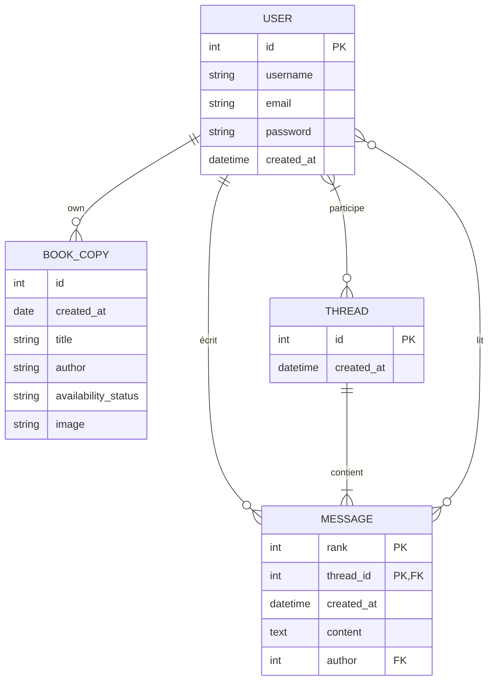

# TomTroc

## Description

TomTroc est une association à but non lucratif visant à encourager le partage de livres et à favoriser les rencontres entre lecteurs. Ce projet consiste à développer un site web permettant aux membres de l'association de se mettre en relation pour échanger des livres. Le site offre des fonctionnalités pour s'inscrire, se connecter, publier des livres à échanger, rechercher des livres, discuter via un système de messagerie et suivre les échanges de livres. Le développement se fait en PHP avec le modèle MVC et la programmation orientée objet (POO) pour une architecture claire et facile à maintenir.

## Prérequis
- PHP 8.4

## Installation du projet

### 1. Cloner le projet

```bash
git clone https://github.com/Vivien60/Formation_OC_Symfony_P6_TomTroc.git
cd Formation_OC_Symfony_P6_TomTroc
```

### 2. Configuration de la base de données

#### 2.1 Créer la base de données

Créez une base de données MySQL nommée `tomtroc` :

```sql
CREATE DATABASE tomtroc CHARACTER SET utf8 COLLATE utf8_general_ci;
```

#### 2.2 Importer les scripts SQL

Importez les scripts SQL dans l'ordre suivant :
1. **Structure de la base de données** : sql/struct.sql
2. **Données de test** : sql/data.sql

Les données de test incluent :
- 4 utilisateurs avec leurs profils
- Plusieurs exemplaires de livres
- Des conversations de messagerie

Comptes de test disponibles :
- Thor (thor@valhala.com)
- Hercule (hercule@olympe.com)
- Prométhée (promethee@ohtrys.com)
- aaa (aaaagg@email.com)

Le fichier `src/scripts/mdp_reset_example.php` contient le script pour modifier les mots de passe des comptes de test.


### 3. Configuration du projet

#### 3.1 Configurer les paramètres de base de données

Modifiez le fichier `src/config/Conf.php` à la ligne 18-22 :

```php
protected function defaultConfig(): array
{
    return array(
        "bddConfig"     => [
            "dsn"           => "mysql:host=localhost;dbname=tomtroc;charset=utf8",
            "user"          => "votre_utilisateur_mysql",  // Modifiez ici
            "password"      => "votre_mot_de_passe_mysql", // Modifiez ici
        ],
        'baseUrl'       => '/Formation_OC_Symfony_P6_TomTroc/', // Ajustez selon votre installation
    );
}
```

Paramètres à modifier :
- `user` : votre nom d'utilisateur MySQL
- `password` : votre mot de passe MySQL
- `baseUrl` : le chemin relatif de votre projet, si dans un sous-dossier par rapport au nom du domaine.

### 4. Création de dossier
Créer le dossier et le fichier `logs/debug.log` à la racine du projet.
Il est utlisé pour debugger explicitement via `Utils::trace(mixed $var)`. 
Il affichera le contenu de la variable, ou un dump si ce n'est pas une simple chaine.

## Structure du projet

```
Formation_OC_Symfony_P6_TomTroc/
├── assets/              # Ressources statiques (CSS, JS, images)
├── logs/                # Fichiers de logs
├── sql/                 # Scripts SQL
│   ├── struct.sql      # Structure de la base de données
│   └── data.sql        # Données de test
├── src/                 # Code source
│   ├── config/         # Configuration de l'application
│   ├── controller/     # Contrôleurs MVC
│   ├── lib/            # Bibliothèques et utilitaires
│   ├── model/          # Modèles (entités et managers)
│   ├── services/       # Services métier
│   └── view/           # Vues et templates
├── index.php           # Point d'entrée de l'application
└── README.md           # Ce fichier
```

## MCD 
Lien vers le MCD :
https://www.mermaidchart.com/app/projects/c5f8f79c-a7fb-41f2-b76d-bf89ac48798b/diagrams/cf6af6ff-2967-45dc-8edf-0712f0f991d9/version/v0.1/edit


## Fonctionnalités

- Inscription et connexion des utilisateurs
- Gestion de profil utilisateur (modification, avatar)
- Ajout et gestion d'exemplaires de livres
- Recherche de livres disponibles pour échange
- Système de messagerie privée entre utilisateurs

## Technologies utilisées

- **Backend** : PHP 8.4 avec architecture MVC et POO
- **Base de données** : MySQL
- **Frontend** : HTML5, CSS3, JavaScript
- **Versionning** : Git


Ce projet est développé dans le cadre du parcours OpenClassrooms "Développeur d'application PHP/Symfony".