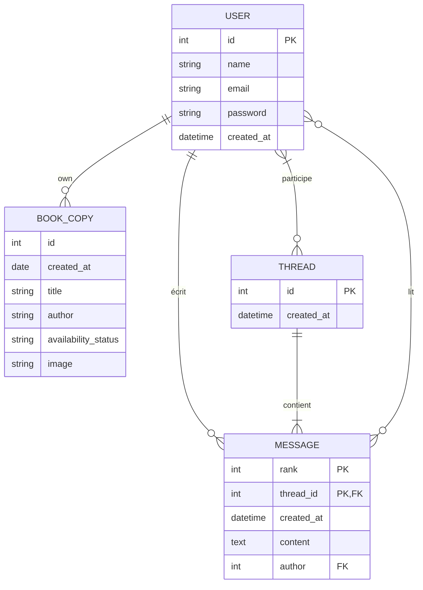

Link to MCD :
https://www.mermaidchart.com/app/projects/c5f8f79c-a7fb-41f2-b76d-bf89ac48798b/diagrams/cf6af6ff-2967-45dc-8edf-0712f0f991d9/version/v0.1/edit

```mermaid
erDiagram
    direction TB
    BOOK_COPY {
        int id  ""  
        date created_at  ""  
        string title  ""  
        string author  ""  
        string availability_status  ""  
        string image  ""  
    }

    USER {
        int id PK
        string name
        string email
        string password
        datetime created_at
    }

    THREAD {
        int id PK
        datetime created_at
    }

    MESSAGE {
        int rank PK
        int thread_id PK,FK
        datetime created_at
        text content
        int author FK
    }

    USER ||--o{ MESSAGE : "écrit"
    THREAD ||--|{ MESSAGE : "contient"
    USER }|--o{ THREAD : "participe"
    USER }o--o{ MESSAGE : "lit"
    USER||--o{BOOK_COPY:"own"
```
